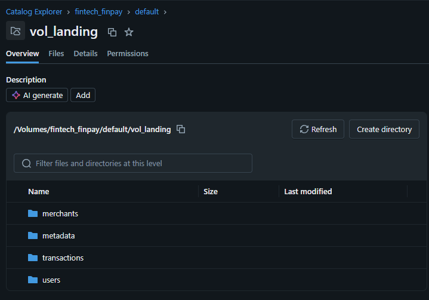

# finpay-lakehouse

Proyecto Integrador: FinPay - Plataforma de Detección de Fraude Transaccional

## Estructura del repositorio

- `databricks.yml`
- `pyproject.toml`
- `README.md`
- `dashboard/`
  - `FinPay_ETL_Pipeline-Observability_Dashboard.lvdash.json`
- `notebooks/`
  - `00_setup.py`
  - `01_policies.sql`
- `resources/`
  - `finpay_etl_pipeline.pipeline.yml`
  - `finpay_ingestion_job.job.yml`
  - `finpay_observability_dashboard.yml`
  - `finpay_semantic_job.pipeline.yml`
- `src/`
  - `bundle_proyecto_etl/`
    - `__init__.py`
    - `finpay_etl_pipeline/`
      - `__init__.py`
      - `bronze_ingestion.py`
      - `gold.py`
      - `merchants_silver.py`
      - `quarantine.py`
      - `rejection_utils.py`
      - `transactions_silver.py`
      - `users_silver.py`
    - `transformations/`
      - `01_crea_vista_materializada_gold.py`
- `vol_landing_files/`
  - `data/`
    - `merchants.json`
    - `transactions_20240101.csv`
    - `transactions_20240102.csv`
    - `transactions_20240103.csv`
    - `users_20240101.txt`
    - `users_20240102.txt`
  - `metadata/`
    - `ingestion_archetypes.json`
    - `schema/`
      - `merchants_schema.json`
      - `transactions_schema.json`
      - `users_schema.json`

## Descripción del proyecto

El objetivo del proyecto es construir un pipeline automatizado de ingesta, procesamiento y publicación analítica, con un modelo dimensional que soporte análisis de fraude y riesgo transaccional.

### Arquitectura general

Este proyecto implementa la arquitectura Medallion completa con tres capas:

- `Bronze`: ingesta raw de archivos fuente sin transformación, preservando los datos originales y agregando columnas técnicas de auditoría.
- `Silver`: limpieza, estandarización, deduplicación y enriquecimiento con dimensiones para normalizar los datos y preparar la base analítica.
- `Gold`: cálculo de KPIs de riesgo, tasas de reversa y detección de anomalías por comercio y canal.

### Características principales

- El pipeline de `Bronze` a `Gold` se ejecuta con Lakeflow Declarative Pipelines.
- Se utilizan `Streaming Tables` con procesamiento batch usando `trigger = availableNow`.
- Los event logs del pipeline están habilitados y persistidos en el schema `fintech_finpay.observability`.

### Componentes clave

- `resources/`: definiciones de pipelines y jobs de Databricks.
- `src/`: código fuente del pipeline y transformaciones.
- `dashboard/`: panel de observabilidad para el pipeline.
- `vol_landing_files/`: archivos fuente y metadatos de la ingesta.

## Pasos de implementación

1. Clonar o descargar el repositorio.
2. Cargar manualmente en el workspace el archivo `00_setup.py`.
3. Ejecutar `00_setup.py` para crear el catálogo, los esquemas y los directorios necesarios, además del volumen para la carga de datos y la creación de funciones de masking y RLS.

   

4. Cargar los archivos de datos de `metadata`, `merchants`, `transactions` y `users` en las carpetas correspondientes.
5. Usar Databricks CLI para iniciar un proyecto bundle utilizando el workspace y el token de autenticación.
6. Colocar los archivos `.yml` en la carpeta `resources` del proyecto bundle.
7. Colocar los archivos de la carpeta `bundle_proyecto_etl` dentro de la ruta `src` correspondiente.
8. Colocar la carpeta `dashboard` dentro de la ruta `src` correspondiente.
9. Tomar como referencia el archivo `databricks.yml` para editar el archivo creado al iniciar el proyecto bundle local.
10. Desplegar.
11. Ejecutar el job `finpay_ingestion_job` para gatillar los Declarative Pipelines: `finpay_etl_pipeline` y `finpay_semantic_job`.
12. Cargar el archivo `01_policies.sql` al workspace y ejecutarlo para aplicar masking y RLS (caso de ejemplo).
13. Ir a la sección de Dashboards dentro de Databricks y verificar la existencia de `FinPay ETL Pipeline - Observability Dashboard`.

## Nota

Esta documentación está orientada a los flujos de datos de ingesta y calidad necesarios para soportar una plataforma de detección de fraude con trazabilidad y observabilidad de extremo a extremo.
